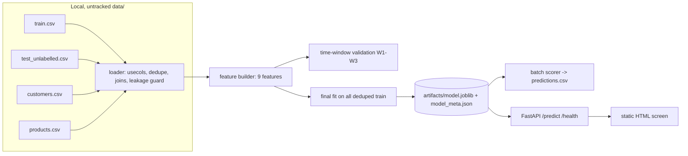

# 02 — Architecture

## Components


## Data flow
1. `data/` holds the 8 pack files locally; it is git-ignored. Nothing in `data/` is committed.
2. Loader reads CSVs with an explicit `usecols` list that **excludes `delivery_note`**, `pickup_scheduled_at` and `last_service_event_type` from the model path. It reads `delivery_pincode` as text only if needed for audit scripts; the model does not use it.
3. De-duplicate on `order_id` (keep the `crm` row), then join `customers` (shield_member) and `products` (family). This join happens only in the local training/validation/batch scripts, using the git-ignored `data/` files. The running service does no joins and reads no data files.
4. Build the 9 features (03). Assert the matrix has exactly those columns.
5. Validation script fits on rows before each window and scores the window.
6. Final script fits on all 10,504 deduped train rows and writes artifacts.
7. Batch scorer writes predictions.csv; API loads the same artifact.

## Model pipeline
`ColumnTransformer([OneHotEncoder(handle_unknown='ignore') on 5 categoricals, StandardScaler on 4 numerics])` then `LogisticRegression(C=0.5, max_iter>=3000, random_state fixed)`. sklearn version pinned; artifact stores sklearn version and a startup check warns on mismatch.

## Suggested repository layout
```
docs/                      (this pack)
src/kestrel_returns/       loader.py features.py train.py validate.py score.py reasons.py api.py config.py
src/kestrel_returns/static/index.html
artifacts/                 model.joblib, model_meta.json (no raw rows)
reports/                   aggregate validation tables only (no row-level data)
tests/
data/                      (git-ignored, local only)
README.md  requirements.txt  .gitignore
```

## FastAPI structure
- `POST /predict` body (pydantic): `sales_channel` (app|web|marketplace|partner_outlet), `payment_mode` (prepaid_upi|prepaid_card|cod|emi), `is_gift` (Y|N), `shield_member` (Y|N), `family` (**required**; one of Air Fryer|Ceiling Fan|Induction Cooktop|Mixer Grinder|Robot Vacuum|Room Heater|Water Purifier), `discount_pct` (0-100), `promised_delivery_days` (>=0), `customer_prior_orders` (>=0), `customer_prior_returns` (>=0 and <= prior_orders). Optional `order_id` echoed back. Extra fields (including `sku` if sent) are allowed but ignored and listed in `ignored_fields`. Any sku-to-family mapping is **not part of v1**: it is an unresolved future/interface question (OQ3) and must not be assumed to ship in the repository. The service runs with only the model artifact; no original data files are needed.
- Response: `order_id?, score, recommend_call, threshold (0.112), threshold_basis ("economic break-even: Rs45 / (0.35 x Rs1150)"), reasons[{text, direction, contribution}], caveats[], ignored_fields[], model_version`.
- `GET /health`; `GET /` serves the HTML screen.
- Polite failure: validation errors become `{error: "plain message", fields: [...]}`; model-load failure returns 503 with a plain message. No outbound network.

## Explanation logic (deterministic)
- For each input, compute its contribution to the log-odds relative to the training average: numerics `coef * standardized_value` (mean is 0 by construction); categoricals `coef(level) - sum_over_levels(train_share * coef(level))`.
- Rank by absolute contribution, take the top 4, and render with fixed templates, e.g. "Cash on delivery orders return more often (historical rate X%)", "Customer has N previous returns", "Shield member: higher return rate in past data (not a reason to hold)".
- Historical group rates for the templates are aggregates saved in `model_meta.json` at training time (no row-level data).
- Mandatory caveat strings in every response: probabilities are approximate; prior-count fields not verified against live systems.

## UI flow
Single static page: form (the 9 inputs; `family` as a dropdown) -> `fetch('/predict')` -> render score, "Confirmation call recommended / Not recommended", reasons, caveats; friendly error panel for 422/503.

## Artifact storage
`artifacts/model.joblib`, `artifacts/model_meta.json` (version, training window, row count, feature list, sklearn version, group rates, threshold constants, validation summary). Committing these is a decision pending OQ2 (they contain fitted parameters and aggregate rates, no raw rows).

## Local startup path (README must show)
`python -m venv .venv` -> activate -> `pip install -r requirements.txt` -> `uvicorn kestrel_returns.api:app --port 8000` -> open `http://localhost:8000`. No keys, no data files needed to serve.

## Security boundaries
- No inbound auth (local use only); bind to localhost by default.
- No outbound calls at inference; no telemetry.
- Raw data only under git-ignored `data/`; CI/test fixtures must be synthetic.
- Never log request bodies. Never pass delivery_note text to any AI tool or code path.
